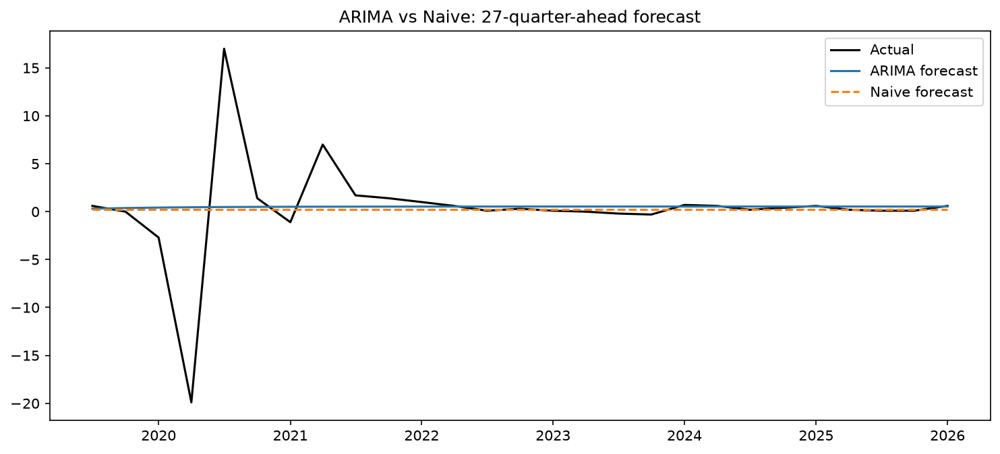
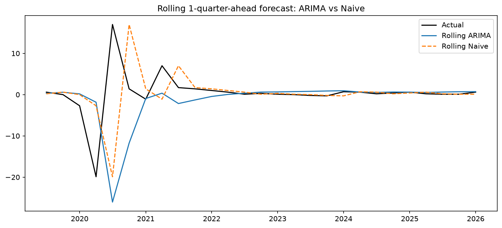

# UK GDP Forecasting

This project tests whether ARIMA can beat a naive forecast for UK GDP 
quarter-on-quarter growth. I used ONS data from 1993 Q1 onward and ran the 
same two tests as my CPIH inflation project: a static long-horizon forecast 
and a rolling one-quarter-ahead forecast. The results turned out the 
opposite way round from CPIH, which turned into the most interesting 
finding of the project.

## Headline result

| Forecast | ARIMA RMSE | Naive RMSE | ARIMA MAE | Naive MAE | Winner (RMSE) |
|---|---|---|---|---|---|
| 27-quarter-ahead (static) | 5.263 | 5.270 | 2.129 | 2.115 | Tie |
| Rolling 1-quarter-ahead | 9.492 | 8.630 | 3.695 | 3.504 | Naive |

Both the static and rolling tests include the 2020 COVID shock, where GDP 
fell 20% in one quarter and rose 17% the next. In my CPIH project, the 
rolling one-month test clearly helped, since inflation rose gradually over 
many months and a short-horizon model could track that climb. Here, rolling 
actually made things worse for both models. GDP's shock was V-shaped rather 
than gradual, so a forecast standing at the bottom of the crash predicts 
another crash, and reality does the opposite. Naive whips between copying 
the crash forward and copying the bounce-back forward, wrong both times. 
ARIMA's AR(1) term extrapolates momentum, which made its worst forecast 
even more wrong than naive's (-26% vs -20%) at the exact turning point.

Removing the COVID quarters and refitting also changed which model terms 
were statistically significant, not just the accuracy numbers. Full detail 
on that is in the methodology doc.

## Charts

**27-quarter-ahead forecast:**

**Rolling 1-quarter-ahead forecast:**

Full methodology and evaluation details are in [`docs/methodology.md`](docs/methodology.md).

## Data

UK GDP Quarter-on-Quarter growth, seasonally adjusted, chained volume 
measure (ONS series IHYQ). ONS confirms this series is comparable back to 
1955, unlike CPIH's pre-2005 data, which ONS itself flags as lower quality. 
I still restricted the sample to 1993 Q1 onward, to stay within a single 
monetary policy regime rather than mixing in very different economic eras 
from the 1950s-80s.

## How to reproduce

1. Clone this repo
2. Create a virtual environment and run `pip install -r requirements.txt`
3. Open `notebooks/01_exploration.ipynb` and run all cells

## Project structure

data/raw          - original ONS CSV
notebooks/        - main analysis notebook
results/figures/  - saved plots
docs/             - full methodology write-up

## Limitations

- Only ~130 quarterly observations, far fewer than CPIH's 250+ monthly 
  points, which raises overfitting risk
- GDP gets revised after first release; this analysis uses the latest 
  available figures, not what would have been known in real time
- Neither model can anticipate a shock like COVID before it happens, since 
  both rely entirely on the series' own past values